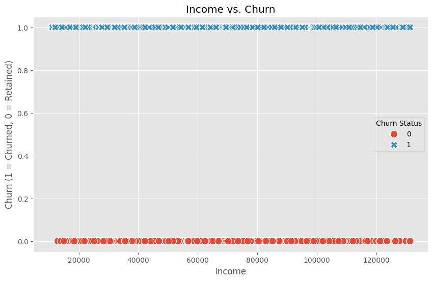
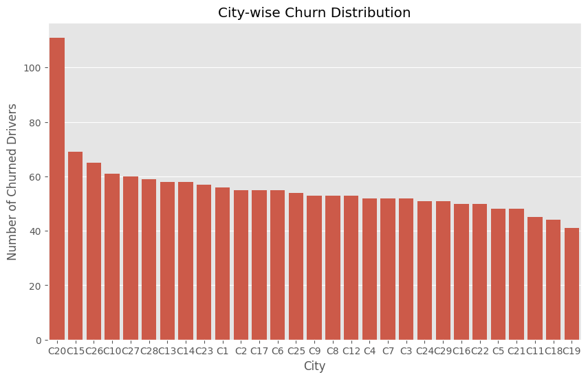
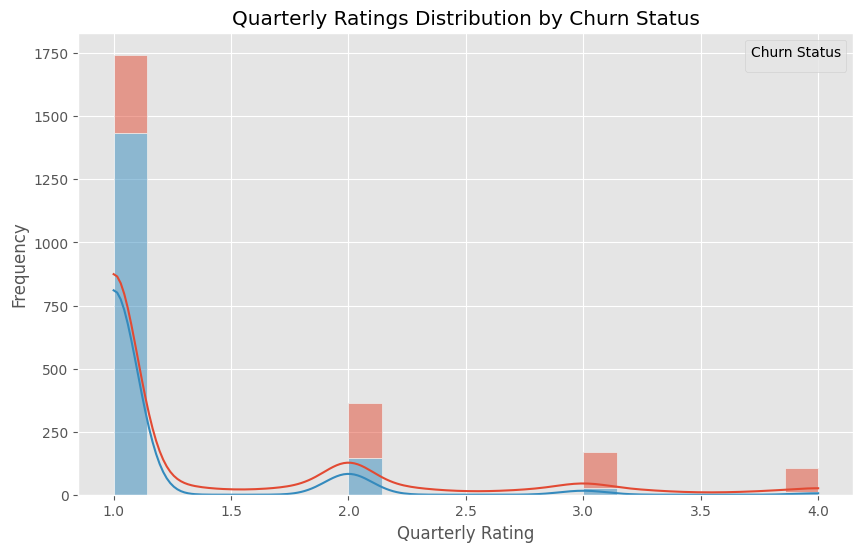
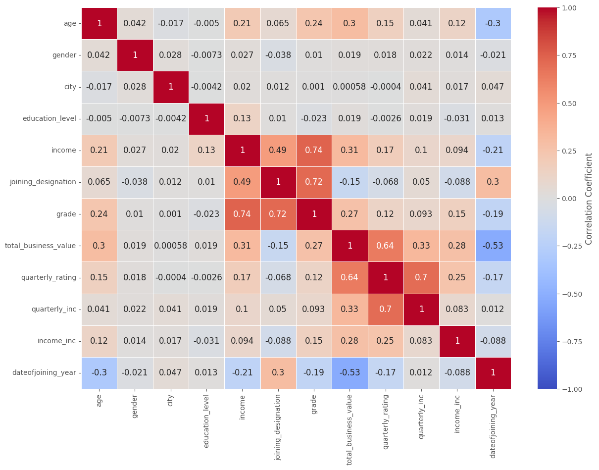
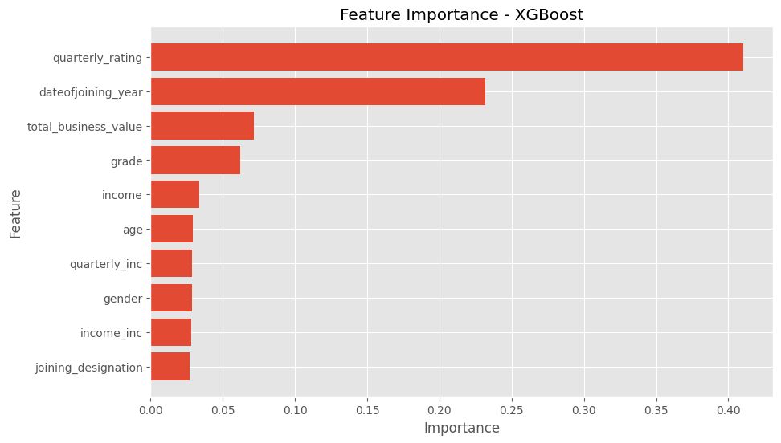
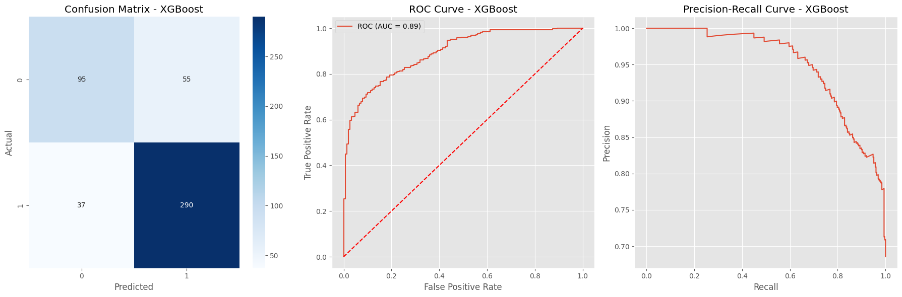

  

<h1 align="center">Ola Driver Churn Analysis</h1>

  
  
  
  

---

## 📚 Table of Contents
- [Project Overview](#project-overview)
- [Objectives](#objectives)
- [Dataset Overview](#dataset-overview)
- [Methodology](#methodology)
  - [Data Preprocessing](#data-preprocessing)
  - [Exploratory Data Analysis (EDA)](#exploratory-data-analysis-eda)
  - [Modeling and Evaluation](#modeling-and-evaluation)
  - [Feature Importance](#feature-importance)
- [Insights and Recommendations](#insights-and-recommendations)
- [Results](#results)
- [Conclusions](#conclusions)
- [Acknowledgments](#acknowledgments)

---

## 🚀 Project Overview

The **Ola Driver Churn Analysis** project examines driver retention on the Ola platform, a leading ride-hailing service in India. Frequent driver churn disrupts operational consistency and drives up costs related to recruiting, training, and onboarding. This project focuses on identifying drivers likely to churn and delivering actionable insights to improve Ola’s retention strategy.

---

## 🎯 Objectives

The project’s main objectives include:
1. **Predicting** which drivers are at risk of leaving.
2. **Profiling** drivers to identify demographic, performance, or behavior patterns linked to churn.
3. **Enabling Data-Driven Retention** by identifying priority drivers for Ola’s retention initiatives, helping to stabilize the driver base and reduce operational costs.

---

## 📊 Dataset Overview

The dataset contains demographic, tenure, and performance-related details for Ola’s driver-partners, forming the basis for understanding patterns and training models to identify drivers at risk.

### Key Features:
- **Driver_ID**: Unique identifier for each driver.
- **Age, Gender, and City**: Demographic details, essential for driver segmentation.
- **Income**: Monthly income level of drivers.
- **Joining Date**: Date of joining Ola.
- **Last Working Date**: Date of last engagement with Ola (null values indicate active drivers).
- **Quarterly Rating**: Driver performance rating (scale of 1-5).
- **Total Business Value**: Monthly revenue contribution, adjusted for cancellations or refunds.

---

## 🧠 Methodology

The analysis approach follows a structured methodology to handle data, extract insights, and develop predictive models effectively.

### 1. Data Preprocessing

**Objective**: Clean and prepare data to optimize model performance and accuracy.

- **Missing Value Handling**: Imputed missing values in `Last Working Date` and `Income`.
- **Encoding Categorical Variables**: Transformed `Gender` and `City` fields to numerical representations.
- **Feature Engineering**: Created derived features such as `Service Duration` and `Income-to-Business Ratio`.
- **Normalization**: Scaled continuous variables like `Income` and `Total Business Value` to ensure equal contribution to the model.

### 2. Exploratory Data Analysis (EDA)

**Objective**: Reveal trends, patterns, and key relationships in the data.

#### Key Visualizations:
  - **Income vs. Churn**:  
      
    Scatter plot illustrating income levels among churned and retained drivers to highlight income impact on churn.

  - **City-wise Churn Distribution**:  
      
    Churn rates visualized across cities to examine region-specific trends.

  - **Quarterly Ratings Distribution**:  
      
    Distribution of driver ratings to analyze performance impact on churn.

  - **Correlation Heatmap**:  
      
    Feature correlation matrix to assess relationships and potential multicollinearity.

### 3. Modeling and Evaluation

#### Models Implemented:
1. **Logistic Regression**: Baseline classifier for interpretability.
2. **Random Forest Classifier**: Model using feature importance to capture non-linear patterns.
3. **XGBoost**: Effective for imbalanced data and complex relationships.

#### Evaluation Metrics:
- **Accuracy**: General prediction correctness.
- **Precision & Recall**: Identifying true churn cases (recall) while minimizing false positives (precision).
- **ROC-AUC Score**: Evaluates model's discrimination ability.

### 4. Feature Importance

Feature importance analysis via **Random Forest** and **XGBoost** highlighted factors most relevant to churn prediction.

#### Findings:
- **Income**: Lower-income drivers are more likely to churn.
- **Service Duration**: Shorter tenure correlates with churn.
- **Quarterly Rating**: Lower ratings increase churn likelihood.
- **City**: Regional differences affect churn rates.

#### Visualization:

--- 

## 🔍 Insights and Recommendations

### Key Insights
1. **Income and Churn Correlation**: Lower-income drivers are more prone to churn.
2. **City-Specific Patterns**: Certain cities show higher churn rates, possibly due to competition or operational challenges.
3. **Performance-Linked Churn**: Lower-rated drivers are likelier to churn, potentially due to reduced ride assignments or customer preference.
4. **Feature Correlations**: `Service Duration` and `Quarterly Rating` are correlated, suggesting longer-serving drivers receive better ratings.

### Recommendations for Ola
1. **Incentivize Low-Income Drivers**: Provide incentives to improve earnings and reduce churn.
2. **City-Specific Retention Strategies**: Implement regional retention strategies in high-churn cities.
3. **Performance Improvement Programs**: Offer training for lower-rated drivers to boost performance and satisfaction.
4. **Tenure-Based Rewards**: Introduce rewards based on service duration to promote long-term retention.
5. **Driver Feedback**: Regular feedback can reveal underlying churn factors for proactive improvements.

---

## ⚙️ Results

| Model                | Precision | Recall   | F1 Score | Train ROC-AUC | Test ROC-AUC |
|----------------------|-----------|----------|----------|---------------|--------------|
| Logistic Regression  | 85.53%    | 81.35%   | 83.39%   | 86.76%        | 86.59%       |
| Random Forest        | 88.39%    | 83.79%   | 86.03%   | 91.41%        | 88.48%       |
| XGBoost              | **84.06%** | **88.69%** | **86.31%** | **91.66%** | **89.38%**   |

### Model Summary
- **Logistic Regression**: Solid baseline model.
- **Random Forest**: Higher precision and F1 score, good generalization.
- **XGBoost**: Highest test ROC-AUC (89.38%) and recall (88.69%), optimal for churn identification.

### XGBoost Evaluation Visualizations

- **Confusion Matrix**: Reflects true positives (290) and false positives (55).
- **ROC Curve**: AUC score of 0.89 highlights separation capability.
- **Precision-Recall Curve**: Shows high precision and recall for effective churn prediction.

---

## 🔑 Conclusions

1. **Reliable Churn Prediction**: Model effectively identifies at-risk drivers.
2. **Insight-Driven Retention**: Churn profiles help Ola focus on at-risk demographics and regions.
3. **Operational Improvements**: Proactive retention reduces onboarding costs and supports consistent service.

---

## 🙏 Acknowledgments

Thanks to Ola for data access and project support. Special gratitude to **Pandas**, **Matplotlib**, **Scikit-learn**, and **XGBoost** contributors for their invaluable tools.
